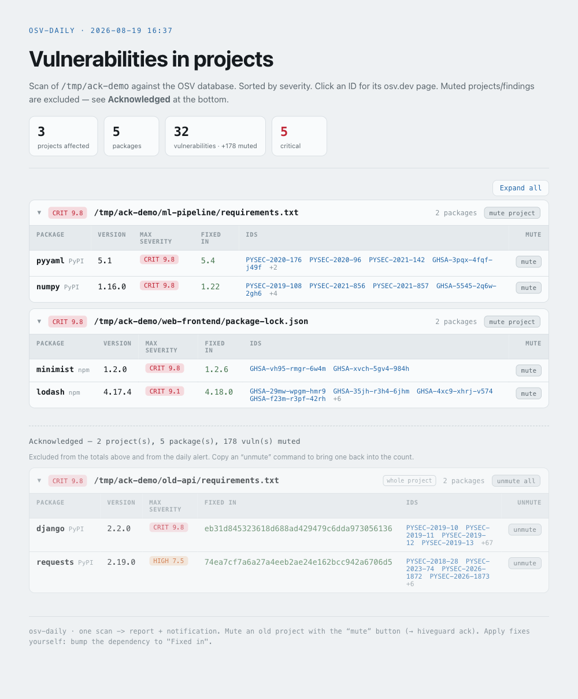
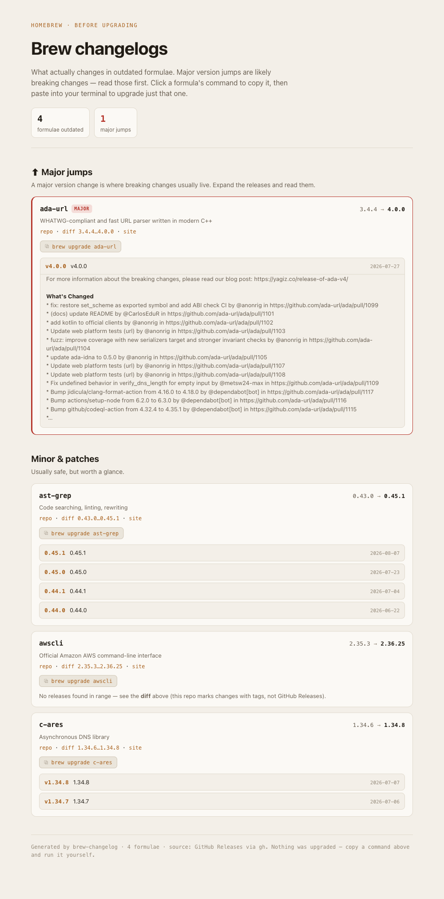

# 🐝 hiveguard

**Supply-chain safety for local dev on macOS** — two independent layers of protection
around the packages you install, behind one `hiveguard` command.

- **Install-time gate** ([bumblebee](#prerequisites)) — before a package is allowed to
  run its install scripts, it's checked against a known-compromised catalog.
- **On-demand & scheduled scanning** ([OSV](https://osv.dev)) — everything already on
  disk is scanned against the OSV database (vulnerabilities **and** malicious packages).

Neither replaces the other. bumblebee stops malware *at the moment of install*; OSV
catches *newly-disclosed* issues in what's already installed, using a *different*
database. hiveguard runs them together.

---

## Why two layers

Think in two axes — they're orthogonal:

| | bumblebee | osv-scanner |
|---|---|---|
| **Malicious packages** | ✅ own threat catalog | ✅ `MAL-` records from OSV |
| **Regular vulnerabilities (CVE)** | ❌ | ✅ |
| **Protects at install moment** | ✅ blocks install scripts | ❌ |
| **Scans what's already installed** | ❌ | ✅ |

The databases are **independent**, so something missing from one can be present in the
other. That's why running both — even on the same ecosystem — increases coverage.

Blind spot for **both**: a true zero-day not yet in any database.

---

## What's in the box

`hiveguard` is the single command. `hvg` is a short alias (`hvg brew` ==
`hiveguard brew`). Everything is a subcommand — there are no separate per-tool commands.

| Subcommand | What it does |
|---|---|
| `hiveguard add <mgr> <pkg>` | Install a package **only after** OSV clears it. Resolves the dependency tree *without installing*, scans it, then installs if clean. Layers on top of bumblebee. |
| `hiveguard scan [path]` | On-demand scan of a project (or global installs) for known vulnerabilities. Refreshes the bumblebee catalog too. |
| `hiveguard daily <folder>…` | The scan behind the daily report: one pass over the folders you name → compact HTML report + macOS notification on findings. Compares against the previous scan to flag what's **new**. |
| `hiveguard schedule on\|off\|status` | Schedule the daily scan — you pick the time and folders. Catches up on the next wake/startup if the Mac was asleep. Not automatic; you turn it on. |
| `hiveguard brew` | Before `brew upgrade`: one HTML page of changelogs for outdated formulae — **major** jumps highlighted, each formula with a one-line description and a copy-ready `brew upgrade` command. Changelogs are cached so re-runs skip the network. |
| `hiveguard ack <path> [pkg]` | Mute an old project (or a single finding) so it stops counting toward the report totals and the daily alert — **except** a genuinely new advisory, which still surfaces and still alerts until you re-ack. Muted items move to a collapsed "Acknowledged" section — never dropped. |
| `hiveguard doctor [--fix]` | Diagnose install/migration health (install method, PATH shadowing, obsolete `~/bin` links, the launchd agent, the shell guard, prerequisites). `--fix` applies only safe, reversible repairs. |
| `hiveguard update` | Self-update: `brew upgrade` under a brew install, or `git pull` + re-run the installer from a source checkout. |

---

## Coverage by ecosystem

`hiveguard add`/`scan` cover what osv-scanner can read; bumblebee gates a subset at
install time.

| Ecosystem / manager | bumblebee (install-gate) | OSV (scan) | add mode |
|---|:---:|:---:|---|
| Node — npm / pnpm / yarn / bun | ✅ | ✅ | full tree |
| Python — pip | ✅ | ✅ | full tree |
| Python — uv / uv tool | ❌ | ✅ | full tree |
| Rust — cargo | ✅¹ | ✅ | coarse² |
| Go — go install | ✅ | ✅ | coarse² |
| Ruby — gem | ❌ | ✅ | coarse² |
| PHP — composer | ❌ | ✅ | coarse² |
| Homebrew — brew | ❌ | ❌ | use `hiveguard brew` |

¹ via `cargo audit`.  ² coarse = checks the named package via the OSV API (no full
dependency tree). Blocks on malicious (`MAL-`), warns on CVEs.

---

## Install

### Homebrew (recommended)

```bash
brew install maximhoffman/hiveguard/hiveguard
```

or, equivalently, tap first:

```bash
brew tap maximhoffman/hiveguard
brew install hiveguard
```

Homebrew pulls in the required tools (`jq`, `osv-scanner`, `python`) automatically as
dependencies, so there's nothing else to install for the core scanning to work. The
optional extras under [Prerequisites](#prerequisites) still add features (desktop
alerts, `hiveguard brew` changelogs, the install-time gate).

> **Honest note:** this needs the first tagged release to be published and the tap
> `maximhoffman/homebrew-hiveguard` to exist. Until then, use the from-source install
> below.

The daily scan is **not** scheduled automatically. Turn it on when you want it:

```bash
hiveguard schedule on ~/Projects   # scan ~/Projects daily at 10:00 (name your folders)
```

See [Scheduling the daily scan](#scheduling-the-daily-scan) for time and folder options.

### From source / development

```bash
git clone https://github.com/maximhoffman/hiveguard.git
cd hiveguard
./install.sh            # links tools into ~/bin
```

The installer symlinks `hiveguard` (plus the short alias `hvg`) into `~/bin`, backs up
any pre-existing file of the same name, writes reports/logs to `~/.hiveguard/`, and
removes obsolete links from older installs (the standalone `safe-add` / `deps-audit` /
`osv-daily` / `brew-changelog` commands and the retired `hg` alias — everything is a
`hiveguard` subcommand now). It also schedules the daily scan at 10:00 unless you opt
out:

```bash
./install.sh --no-agent      # don't schedule the daily scan
./install.sh --hour 9        # schedule the daily scan at 09:00 instead of 10:00
```

You can always change or remove the schedule afterwards with `hiveguard schedule`.

**`~/bin` must be on your `PATH`.** If it isn't (the installer warns you), the commands
only resolve by full path. Add this to your `~/.zshrc` and open a new terminal:

```bash
export PATH="$HOME/bin:$PATH"
```

A source install pulls the required tools yourself:

```bash
brew install jq osv-scanner
```

### Updating

```bash
hiveguard update
```

`hiveguard update` does the right thing for how you installed it:

- **Homebrew install** → runs `brew upgrade hiveguard`.
- **Source install** → `git pull --ff-only` the clone, then re-runs `install.sh`
  (refreshing the symlinks and the launchd agent).

You can also run the native update directly — `brew upgrade hiveguard` under brew, or
`cd /path/to/hiveguard && git pull && ./install.sh` from a clone.

A changed report layout shows up on the **next scan** — wait for the daily run, or
trigger one now:

```bash
hiveguard daily        # regenerate ~/.hiveguard/osv-projects.html right away
```

### Prerequisites

Under Homebrew the required tools (`jq`, `osv-scanner`, `python`) arrive automatically.
For a source install, grab them yourself: `brew install jq osv-scanner`.

Everything below is **optional but recommended**:

- **gh** (`brew install gh`, then `gh auth login`) — `hiveguard brew` uses it to pull
  release notes from GitHub.
- **terminal-notifier** (`brew install terminal-notifier`) — desktop notifications when
  a scan finds something. Without it, findings still land in the report and the log.
- **bumblebee** — the install-time gate. It's a separate upstream tool: a Go binary
  plus a threat-intel catalog. Install the binary (`go install …`) and clone the
  catalog to `~/bumblebee-src`, then source the guard in your shell:

  ```bash
  # ~/.zshrc
  source "$HOME/bin/bumblebee-guard.sh"
  ```

  Without it, `hiveguard add`/`scan` still work (OSV layer only) — you just lose the
  install-moment gating on npm/pip/go/cargo.

Run `hiveguard doctor` at any time to see which of these are present and whether your
install is healthy.

---

## Usage

Everything runs through the single `hiveguard` command (or `hvg`):

```bash
hiveguard add   npm react-router     # gated install
hiveguard scan  ~/Projects/app       # scan a project for known vulns
hiveguard daily                      # full scan → HTML report
hiveguard brew                       # changelogs before brew upgrade
hvg brew                             # same thing, short alias
```

### `hiveguard add` — gated install

```bash
hiveguard add npm  react-router     # extra args pass through: hiveguard add npm react-router -g
hiveguard add pip  requests
hiveguard add uv   serena-agent     # uv tool install — covers the bumblebee gap
hiveguard add gem  nokogiri         # coarse (name-only) check

hiveguard add npm  lodash@4.17.4 --check-only   # scan only, don't install
hiveguard add npm  something --force            # install despite critical/MAL (deliberate)
```

Policy:

- **`MAL-` (malicious package)** → hard stop.
- **critical (CVSS ≥ 9)** → stop (override with `--force`).
- other CVEs → warn, install proceeds.

Example — a package with high-but-not-critical issues installs with a warning; one with
a critical CVE is blocked:

```
$ hiveguard add npm react-router@7.13.0 --check-only
vulnerable packages in tree: 1
  CVE   react-router@7.13.0   GHSA-2j2x-hqr9-3h42,GHSA-337j-9hxr-rhxg,…
⚠ vulnerabilities present (12; high: 6), none critical — proceeding

$ hiveguard add npm lodash@4.17.4 --check-only
  CRIT  lodash@4.17.4         GHSA-jf85-cpcp-j695,…
✖ critical (CVSS≥9): 1
Install cancelled. Override deliberately with --force
```

### `hiveguard scan` — scan on demand

```bash
hiveguard scan                 # scan the project in the current directory
hiveguard scan ~/Projects/app  # scan a specific project
hiveguard scan --global        # scan global installs (npm -g, uv tools)
hiveguard scan --no-refresh    # skip refreshing the bumblebee catalog
```

### `hiveguard daily` — the scan behind the report

```bash
hiveguard daily ~/Projects       # scan one or more folders → HTML report + notification
hiveguard daily ~/work ~/code    # multiple folders allowed
```

`daily` needs **at least one folder** — there is no whole-home default. (Scanning the
whole home folder as a background agent is slow and, on macOS, the OS blocks it from
reading protected folders like Documents/Desktop, so it silently finds nothing.) A fixed
set of heavyweight/system directories (`Library`, `Caches`, `node_modules`, `.git`,
`.cargo`, `go`, …) is excluded so pointing at a large tree stays fast.

Report: `~/.hiveguard/osv-projects.html`. Log: `~/.hiveguard/osv-daily.log`.

**Re-running when today's report already exists** opens it and offers to rescan. Before
opening, it also prints a **recovered summary** of the last scan's figures — projects,
packages, vulns, critical, acknowledged, and "N new" — so you can recover the numbers
from a notification you missed. Flags:

```bash
hiveguard daily --open     # just open the last report, never scan
hiveguard daily --rescan   # force a fresh scan now, no prompt
hiveguard daily --if-due   # scan only if today's report is missing/stale (used by the scheduler)
```

The report groups findings by project, sorted by severity, with the fixed-in version and
osv.dev links for every advisory (theme-aware — adapts to light/dark):



#### New since last scan

Each scan compares against the previous one **over the same set of folders**. What
changed shows up as:

- a **new since last scan** tile in the report header,
- a `NEW +n` badge on the affected rows (with the new advisory IDs accented),
- a `· N new` suffix on the notification and the done-line, and
- a resolved-count footer line when findings have been fixed since last time.

The very first scan of a folder set (no baseline yet) simply reports everything without
"new" markers — the comparison starts from the next run.

### Scheduling the daily scan

Scheduling is a command you run — nothing is scheduled until you turn it on. You pick the
**time** and the **folders**:

```bash
hiveguard schedule on ~/Projects                        # daily at 10:00, scanning ~/Projects
hiveguard schedule on --hour 9 --min 30 ~/work ~/code   # 09:30, two folders
hiveguard schedule off                                  # unschedule
hiveguard schedule status                               # time, folders, loaded?, last run
```

- `on [--hour H] [--min M] <folder>…` — `H` is 0–23, `M` is 0–59 (default 10:00). **Name
  at least one folder** — there is no whole-home default (a background home scan is slow
  and, on macOS, blocked from protected folders). Multiple folders allowed. Re-running
  `on` replaces any existing schedule.
- **Catch-up:** if your Mac is **asleep or off** at the scheduled time, the scan runs at
  the next wake or startup instead — so you don't silently skip a day.
- `off` removes the schedule; safe to run when nothing is scheduled.
- `status` shows whether it's scheduled, at what time, which folders, whether the agent
  is loaded, and the last recorded run.

Under the hood this manages a launchd agent (`com.hiveguard.osv-daily`) that invokes
`hiveguard daily --if-due`, so a catch-up run only actually scans when today's report is
missing.

### Muting old projects (`hiveguard ack`)

An old project you don't run still has vulnerable pinned versions — but you don't need a
fresh alert about it every morning. **Mute** it: muted projects and findings stop
counting toward the totals and the notification, and move to a collapsed **Acknowledged**
section so nothing is ever lost.

```bash
hiveguard ack ~/Projects/old-app/package-lock.json          # mute a whole project
hiveguard ack ~/Projects/app/requirements.txt django        # mute one package/finding
hiveguard ack --list                                        # what's currently muted (+ counts & since-dates)
hiveguard ack --remove ~/Projects/old-app/package-lock.json # bring it back
hiveguard ack --clear                                       # drop every acknowledgement
```

**Acknowledgements are advisory-scoped.** Muting accepts the advisories that are **known
at the time you ack** — not the project or package forever. A genuinely **new** advisory
that later appears in a muted project or package **still surfaces** (badged `muted` in
the Active section) and **still fires the notification** — *new pierces the mute*. To
accept it too, run the same `hiveguard ack …` again (or click the report's **re-ack**
button), which folds the new advisory into the mute and goes quiet again.

**Worked example:**

```bash
hiveguard ack ~/Projects/old-app/package-lock.json lodash
# → "N known advisories acknowledged; NEW future advisories will still alert."
```

Later, a new advisory for `lodash` lands. On the next scan it appears in the **Active**
section badged `muted`, and the daily alert fires. Click **re-ack** on that row (it
copies the same `hiveguard ack …` command) — run it, and the project is quiet again,
now with the new advisory folded in.

Acknowledgements made **before** this advisory-scoped behavior existed are
**grandfathered** on the next scan: everything present at that scan is accepted, and only
advisories that appear *after* it will pierce the mute.

Every row in the report carries a **mute** / **unmute** button that copies the exact
command for that project or package — click, paste, run. Acknowledgements persist in
`~/.hiveguard/osv-acks.json`, so the next scan and the scheduled agent both honour them.
When everything active is acknowledged, the report shows zero and the daily notification
stays quiet (until a new advisory pierces a mute). The `<path>` is the source path
(lockfile/manifest) shown on each project row.

### `hiveguard brew` — read before you upgrade

```bash
hiveguard brew                 # all outdated formulae → HTML page, majors on top
hiveguard brew --no-update     # skip `brew update` first (faster)
hiveguard brew --refresh       # ignore the cache, refetch changelogs from GitHub
hiveguard brew --no-cache      # don't read or write the cache
ONLY=z3,ffmpeg hiveguard brew  # only these
```

Each formula card shows a **one-line description** (what the package is), its changelog
across the version range, and a **copy button** with the exact `brew upgrade <formula>`
command — click it, paste into your terminal, upgrade just that one. Nothing is upgraded
automatically — it's a read-first tool.

**Changelog cache.** Release notes are cached per formula + target version under
`~/.hiveguard/cache/brew-releases/`, so re-running within the TTL (default 6h) skips the
network. A real version bump changes the cache key and refetches — you never see a stale
changelog for a new upgrade. Tune with `BREW_CHANGELOG_TTL` (seconds) and
`BREW_CHANGELOG_CACHE` (dir); bypass with `--refresh` / `--no-cache`.

Major jumps are separated from minor/patch updates; each card carries the package
description, its changelog for the version range, and a copy-ready `brew upgrade` command:



### `hiveguard doctor` — check your install

```bash
hiveguard doctor          # read-only health check (exits non-zero on any ✖)
hiveguard doctor --fix    # also apply safe, reversible repairs
```

`doctor` diagnoses install and migration health: how hiveguard was installed and its
version, whether `hiveguard`/`hvg` on your `PATH` resolve to the active install (PATH
shadowing), obsolete `~/bin` symlinks from older installs, the state of the launchd
daily-scan agent, whether the bumblebee guard is sourced, and the prerequisites. Each
line is ✓ (healthy) / ! (worth noting) / ✖ (broken).

`--fix` only ever performs **safe, reversible** repairs: it removes obsolete `~/bin`
symlinks that hiveguard itself created (the retired standalone command names and the `hg`
alias), and boots out + removes a launchd agent that points at a missing or foreign
install. It **never** edits `~/.zshrc` and **never** removes a non-symlink file — those
are printed as instructions for you to apply.

---

## Migrating from the source install to Homebrew

Already using a `git clone` + `./install.sh` install and want to switch to Homebrew?

1. **Install via Homebrew:**

   ```bash
   brew install maximhoffman/hiveguard/hiveguard
   ```

2. **Clean up the old install:**

   ```bash
   hiveguard doctor --fix
   ```

   This removes the old `~/bin` symlinks and a stale launchd agent pointing at the clone.
   (It won't touch `~/.zshrc` — if `doctor` flags the bumblebee guard line, update it by
   hand as instructed.)

3. **Verify the brew copy wins on your `PATH`:**

   ```bash
   which hiveguard        # should point at the Homebrew copy, not ~/bin
   ```

   If it still points at `~/bin`, reorder your `PATH` (or remove the leftover `~/bin`
   symlinks `doctor` mentions) so the brew install resolves first.

4. **Re-enable scheduling** (it replaces the old agent):

   ```bash
   hiveguard schedule on
   ```

5. **Optionally delete the old clone** once everything checks out.

Your `~/.hiveguard` data — acknowledgements, cache, reports, and logs — carries over
untouched; nothing is lost in the move.

---

## Where hiveguard keeps its data (`~/.hiveguard`)

| Path | What it is |
|---|---|
| `osv-projects.html` | The latest daily report. |
| `osv-daily.log` | One line per scan (counts + new/resolved). |
| `osv-acks.json` | Your acknowledgements (advisory-scoped mutes). |
| `osv-last-scan.json` | The scan state / diff baseline — how "new since last scan" is computed. Override with `HIVEGUARD_STATE`. |
| `cache/brew-releases/` | Cached `hiveguard brew` changelogs. |

---

## How `hiveguard add` resolves without installing

Per ecosystem it computes the full dependency tree **without touching your system**,
then scans the result:

- **npm/pnpm/yarn/bun** — `npm install <pkg> --package-lock-only --ignore-scripts` in a
  temp dir → `package-lock.json` → osv-scanner.
- **pip** — `pip install <pkg> --dry-run --report` → `requirements.txt` → osv-scanner.
- **uv** — `uv pip compile` → `requirements.txt` → osv-scanner.
- **others** — OSV API query on the named package (no tree).

If clean (or `--force`), it sources the bumblebee guard and runs the real install, so
on npm/pip/go/cargo you get **both** databases at once.

---

## Limitations

- Coarse mode (gem/cargo/go/composer) checks only the top-level package, not its
  dependencies. Full-tree support needs a lockfile-generation step per manager.
- OSV finds only **known** issues. A brand-new attack not yet in OSV (or the bumblebee
  catalog) passes.
- Paths assume Apple Silicon Homebrew (`/opt/homebrew`). Adjust `PATH` in the scripts
  for Intel Macs (`/usr/local`).
- The `real install` step of `hiveguard add` runs in the current directory — run it from
  the root of the target project, like a normal `npm install`.

---

## License

MIT — see [LICENSE](./LICENSE).
</content>
</invoke>
